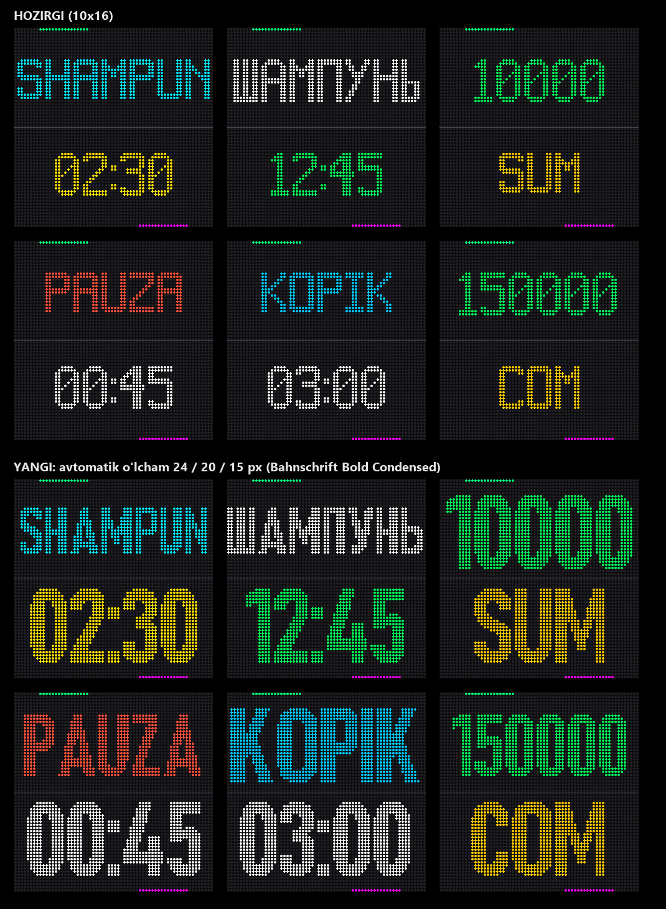

# P5 Carwash Display — universal (ESP32 + HUB75)

Avtomoyka shoxobchalari uchun LED tablo dasturi. ESP32 HUB75 RGB LED panellarni boshqaradi va Serial port orqali keladigan JSON buyruqlarni ko'rsatadi: xizmat nomi, qolgan vaqt, balans, valyuta, xatolik holati.

**Bitta firmware — hamma panel uchun.** Panel turi kodda emas, Serial orqali bir marta tanlanadi va ESP32 xotirasida saqlanadi:

| Panel | Scan | Buyruq |
| :--- | :---: | :--- |
| P5 2121-3264-16S-M5 | 1/16 | `{"panels":"16s"}` |
| HYP5-1921-64x32-8S-H3.2 | 1/8 | `{"panels":"8s"}` |
| Ikkalasi ustma-ust (64x64) | aralash | `{"panels":"16s,8s"}` |

Ko'p tilli: lotin va kirill alifbolari (qirg'izcha `Ң Ө Ү` bilan), UTF-8 dekoder.

- **Bitta panel (64x32):** sinalgan proporsional 16x10 shrift — [2121 versiyasi](https://github.com/Asilhub/ESP32_P5_2121_display) bilan bir xil ko'rinish.
- **Ikki panel (64x64):** Bahnschrift Bold Condensed, har bir qatorga sig'adigan eng katta o'lcham avtomatik tanlanadi (24 / 20 / 15 px).



**Versiya:** 1.0.0
**Kontroller:** ESP32 (original, 2016)

> Faqat bitta 2121 panel uchun alohida, sinalgan va qotirilgan versiya: [ESP32_P5_2121_display](https://github.com/Asilhub/ESP32_P5_2121_display).

---

## Mundarija

1. [Tezkor boshlash](#1-tezkor-boshlash)
2. [Apparat va ulanish](#2-apparat-va-ulanish)
3. [Panel sozlamasi](#3-panel-sozlamasi)
4. [Yorqinlik](#4-yorqinlik)
5. [JSON protokoli](#5-json-protokoli)
6. [Ekranda joylashuv](#6-ekranda-joylashuv)
7. [Barcha JSON misollari](#7-barcha-json-misollari)
8. [Serial javoblari](#8-serial-javoblari)
9. [Muammolar va yechimlar](#9-muammolar-va-yechimlar)
10. [Ma'lum cheklovlar](#10-malum-cheklovlar)
11. [Kompilyatsiya va yuklash](#11-kompilyatsiya-va-yuklash)
12. [Qanday ishlaydi](#12-qanday-ishlaydi)
13. [Fayl tuzilmasi](#13-fayl-tuzilmasi)

---

## 1. Tezkor boshlash

1. Firmware'ni ESP32 ga yuklang — tayyor `release/p5_carwash_v1.0.0_FULL.bin` → `0x0` ([11-bo'lim](#11-kompilyatsiya-va-yuklash)).
2. Panel(lar)ni ulang ([2-bo'lim](#2-apparat-va-ulanish)).
3. Arduino IDE → **Serial Monitor**: tezlik **115200**, pastki o'ng burchakda **Newline**.
4. Panel turini yuboring (bir marta):
   ```json
   {"panels":"16s,8s"}
   ```
5. Sinab ko'ring:
   ```json
   {"type":"SHAMPUN","value":230}
   ```

Birinchi yoqilganda (hech narsa yuborilmagan bo'lsa) standart sozlama — **bitta 16S panel** (`16s`).

---

## 2. Apparat va ulanish

### Pinout

| HUB75 pin | ESP32 GPIO | Vazifasi |
| :--- | :---: | :--- |
| **R1** | 18 | Qizil, yuqori yarim |
| **G1** | 17 | Yashil, yuqori yarim |
| **B1** | 16 | Ko'k, yuqori yarim |
| **R2** | 15 | Qizil, quyi yarim |
| **G2** | 19 | Yashil, quyi yarim |
| **B2** | 21 | Ko'k, quyi yarim |
| **A** | 4 | Satr tanlash A |
| **B** | 22 | Satr tanlash B |
| **C** | 14 | Satr tanlash C |
| **D** | 13 | Satr tanlash D — **16S panel uchun shart** |
| **E** | 5 | Satr tanlash E (32 qatorli panellarda ishlatilmaydi) |
| **LAT / STB** | 26 | Latch |
| **OE** | 25 | Output Enable |
| **CLK** | 27 | Taktlash |
| **GND** | GND | Umumiy yer — kamida 2 ta GND simini ulang |

Pinlarni o'zgartirish: [`p5_carwash.ino`](p5_carwash.ino) boshidagi `#define` bloki.

### Ikki panelni ustma-ust ulash

Panellar bitta zanjirga ketma-ket ulanadi: ESP32 → 1-panel **IN**, 1-panel **OUT** → 2-panel **IN**.

> **Qoida: 16S panel doim zanjirda BIRINCHI bo'ladi** (ESP32 ga to'g'ridan-to'g'ri ulanadi).
>
> 8S panel o'zining OUT razyomidan signallarni keyingi panelga uzatmaydi. ESP32 → 8S → 16S qilib ulansa, 16S panel umuman yonmaydi (sinab ko'rilgan).

Ikki xil joylashuv mumkin:

**A) 16S tepada, 8S pastda** (sinalgan):

```
ESP32 ──► 16S (tepa)  IN
          16S (tepa)  OUT ──► 8S (past) IN
```
```json
{"panels":"16s,8s"}
```

**B) 8S tepada, 16S pastda:**

```
ESP32 ──► 16S (past)  IN
          16S (past)  OUT ──► 8S (tepa) IN
```
```json
{"panels":"8s,16s","input":"bottom"}
```

### Quvvat

Panellar ESP32 dan emas, **alohida 5 V manbadan** oziqlanadi.

- Bitta 64x32 P5 panel to'liq oq rangda ~3.5–4 A tortadi. Bitta panel uchun kamida **5 V / 5 A**, ikkita panel uchun **5 V / 10 A** blok qo'ying.
- ESP32 va barcha panellarning **GND** lari birlashtirilgan bo'lishi shart.
- Standart yorqinlik `120` (255 dan). Bu tokni cheklaydi va panelni qizib ketishdan saqlaydi.

---

## 3. Panel sozlamasi

ESP32 panel turini o'zi aniqlay olmaydi: HUB75 bir tomonlama, paneldan hech qanday javob qaytmaydi. Shuning uchun tur **bir marta** yuboriladi.

```json
{"panels":"<tepadagi>,<pastdagi>","input":"top|bottom"}
```

| Kalit | Qiymat | Ma'nosi |
| :--- | :--- | :--- |
| `panels` | `"16s"`, `"8s"`, `"16s,8s"`, `"8s,16s"`, `"16s,16s"`, `"8s,8s"` | Panellar **tepadan pastga**, vergul bilan. Ko'pi bilan 2 ta |
| `input` | `"top"` (standart) yoki `"bottom"` | ESP32 kabeli qaysi panelga ulangan |
| `flip` | `"none"` (standart), `"top"`, `"bottom"`, `"both"` | Qaysi panel 180° aylantirib qo'yilgan |

- Panel nomi uchun faqat son muhim: `16s`, `16S`, `16` — hammasi bir xil.
- Sozlama yuborilgach ESP32 **o'zi qayta yuklanadi** (1–2 soniya).
- Sozlama xotirada saqlanadi: o'chirib-yoqishda ham, Arduino IDE orqali qayta yuklashda ham o'chmaydi.
- `panels` o'zgarganda panel yorqinliklari (`level`) standart holatga qaytadi.

### Hamma holatlar

| Joylashuv | Ulanish | Buyruq |
| :--- | :--- | :--- |
| Bitta 2121 (16S) | ESP32 → 16S | `{"panels":"16s"}` |
| Bitta 1921 (8S) | ESP32 → 8S | `{"panels":"8s"}` |
| Tepa 16S, past 8S | ESP32 → 16S → 8S | `{"panels":"16s,8s"}` |
| Tepa 8S, past 16S | ESP32 → 16S (past) → 8S (tepa) | `{"panels":"8s,16s","input":"bottom"}` |
| Ikkita 16S | ESP32 → tepa → past | `{"panels":"16s,16s"}` |
| Ikkita 8S | ESP32 → tepa → past | `{"panels":"8s,8s"}` |
| Ikkita 8S, pastkisi 180° aylantirilgan (qisqa shleyf) | ESP32 → tepa → past | `{"panels":"8s,8s","flip":"bottom"}` |
| Ikkita 16S, pastkisi 180° aylantirilgan | ESP32 → tepa → past | `{"panels":"16s,16s","flip":"bottom"}` |

> **`flip` qachon kerak:** ikkita bir xil panelni qisqa shleyf bilan ulash uchun pastkisini ko'pincha 180° aylantirib qo'yishga to'g'ri keladi (orqa tomondagi strelkalar qarama-qarshi). Shunda pastki yarmi teskari chiqadi — `"flip":"bottom"` uni to'g'rilaydi. Qaysi panel teskari ko'rinsa, o'shani yozing.

### Panel nomini o'qish

| Nomdagi bo'lak | P5 2121-3264-**16S**-M5 | HYP5-1921-64x32-**8S**-H3.2 |
| :--- | :--- | :--- |
| P5 | piksellar orasi 5 mm | piksellar orasi 5 mm |
| 2121 / 1921 | LED 2.1×2.1 mm (indoor) | LED 1.9×2.1 mm (outdoor, yorug'roq) |
| 3264 / 64x32 | 64×32 piksel | 64×32 piksel |
| **16S / 8S** | **1/16 scan → `16s`** | **1/8 scan → `8s`** |

Kod uchun faqat **S** oldidagi son muhim.

---

## 4. Yorqinlik

Ikki xil sozlama bor. Ikkalasi ham **darhol** qo'llanadi (qayta yuklanmaydi) va xotirada saqlanadi.

| Buyruq | Qiymat | Nima qiladi |
| :--- | :--- | :--- |
| `{"brightness":120}` | 1–255, **qo'shtirnoqsiz son** | Umumiy yorqinlik, hamma panelga bir xil |
| `{"level":"100,60"}` | 1–100 % yorug'lik, **qo'shtirnoq ichida**, tepadan pastga | Har bir panel alohida |

### Nega kerak

Ustma-ust ulanganda 8S panel 16S dan ancha yorug' ko'rinadi:

- 8S panelning har bir qatori 2 barobar uzoq yonadi (1/8 va 1/16 scan).
- 1921 (outdoor) LED'lar 2121 (indoor) dan yorug'roq.

Birinchi sababni kod **o'zi** yo'qotadi: aralash zanjirda 8S qatori 16S bilan bir xil vaqt (1/16) yonadi — rang aniqligi yo'qolmaydi. Ikkinchi sababni (LED farqi) `level` bilan ko'z bilan tenglashtirasiz. Hamma panel **100%** dan boshlanadi.

> **Sinalgan qiymat:** 8S (1921) tepada, 16S (2121) pastda, `brightness` 150 — `{"level":"30,100"}`. 16S tepada bo'lsa — teskarisi: `{"level":"100,30"}`.

`level` — bu haqiqiy **yorug'lik foizi**: 60% yozilsa, panel MECANUZ nafas olayotganda ham eng yorug', ham eng xira paytida aynan 60% yorug'likda bo'ladi. Shuning uchun bir marta tenglashtirilsa, butun animatsiya davomida bir xil ko'rinadi.

### Sozlash tartibi

1. MECANUZ ekranda turganda uning tepa va pastki yarmini solishtiring.
2. Yorug' panelning (odatda 8S) foizini pasaytiring. Misol — 8S tepada, 16S pastda:
   ```json
   {"level":"60,100"}
   ```
   | Ko'rinishi | Keyingi qadam |
   | :--- | :--- |
   | 8S hali ham yorug'roq | `{"level":"45,100"}` |
   | 8S endi xiraroq | `{"level":"75,100"}` |
   | Bir xil | Tayyor, saqlanib qoldi |
3. Ikkalasi tenglashgach, umuman yorug'roq kerak bo'lsa umumiy yorqinlikni oshiring:
   ```json
   {"brightness":180}
   ```

> **Ehtiyot:** `brightness` oshsa tok ham oshadi — quvvat blokiga qarang. 8S panel foizda pasaytirilgani uchun uning toki ham kamayadi.

> **Juda past foizda** (≈20% va undan past) rang aniqligi yo'qolishi mumkin: eng xira paytda pog'onali ko'rinadi.

---

## 5. JSON protokoli

Serial port, **115200 baud**, har bir buyruq `\n` (yangi qator) bilan tugaydi. Bitta buyruq — bitta qator.

### Kalitlar

| Kalit | Turi | Tavsif |
| :--- | :--- | :--- |
| `type` | matn | Rejim yoki ko'rsatiladigan matn (lotin) |
| `typeuz` / `textuz` | matn | Xuddi `type` kabi, lotin alifbosi |
| `typekg` / `textkg` | matn | Kirill rejimi (qirg'izcha) |
| `typekr` / `textkr` | matn | Kirill rejimi |
| `value` | son | Balans yoki vaqt — **MMSS formatida**, pastdagi izohga qarang |
| `colorR1` `colorG1` `colorB1` | 0–255 | Matn rangi (1-rang) |
| `colorR2` `colorG2` `colorB2` | 0–255 | Vaqt / raqam rangi (2-rang) |
| `panels`, `input` | matn | Panel sozlamasi — [3-bo'lim](#3-panel-sozlamasi) |
| `level` | matn | Panel yorqinligi — [4-bo'lim](#4-yorqinlik) |
| `brightness` | son | Umumiy yorqinlik — [4-bo'lim](#4-yorqinlik) |

- Rang yuborilmasa — oq (255).
- Kalitlar shu tartibda tekshiriladi: `panels` → `level` → `brightness` → `typekr` → `textkr` → `typekg` → `textkg` → `typeuz` → `textuz` → `type`. Birinchi topilgani ishlatiladi.
- Sozlash buyruqlari (`panels`, `level`, `brightness`) ekrandagi matnni o'zgartirmaydi.
- Hech qanday kalit topilmasa — `MECANUZ` rejimi.

### `value` maydoni — MMSS, soniya emas

`formatTime()` funksiyasi qiymatni `/100` va `%100` qiladi:

| Yuborilgan | Ekranda |
| :---: | :---: |
| `300` | `03:00` |
| `230` | `02:30` |
| `45` | `00:45` |
| `1230` | `12:30` |

Ya'ni 2 daqiqa 30 soniya uchun `230` yuboriladi, `150` emas. Soniya qismi 59 dan oshmasligi kerak (`175` yuborilsa ekranda `01:75` chiqadi).

### Rejimlar

| Kalit so'z | Rejim | Ekranda |
| :--- | :--- | :--- |
| `MECANUZ`, `CARWASH`, `KGCARWASH`, `KG` | Logotip | `MECANUZ`, nafas oluvchi oq rang |
| `PP<matn>PP` | Valyuta | Raqam (`value`) + `<matn>` |
| `KG<matn>KG` | Valyuta | Xuddi shunday, avto-tarjimasiz |
| `SUM` | Raqam | Faqat `value` raqami, markazda |
| `SOM`, `СОМ` | Valyuta | Raqam + `SOM` / `СОМ` |
| `TEST` | Sinov | Butun alifbo va raqamlar skroll qiladi |
| boshqa har qanday matn | Matn + vaqt | Matn + `MM:SS` |

**Ranglar rejimga qarab:**

| Rejim | 1-rang (`colorR1/G1/B1`) | 2-rang (`colorR2/G2/B2`) |
| :--- | :--- | :--- |
| Matn + vaqt | matn | vaqt |
| Valyuta | valyuta nomi | raqam |
| `SUM` | — | raqam |
| `MECANUZ`, `ERROR` | e'tiborga olinmaydi | e'tiborga olinmaydi |

**Avto-tarjimalar:**

- `PPsumPP` yoki `PPsomPP` + kirill kaliti (`typekg`/`typekr`) → `СОМ` chiqadi.
- Kirill rejimida `SHAMPUN` → `ШАМПУНЬ`, `PAUZA` → `ПАУЗА`.
- Kirill rejimida lotin harflar harfma-harf kirillga o'giriladi (`A`→`А`, `B`→`Б`, `V`→`В`, ...).

**Vaqt tugaganda:** matn rejimida `value` 0 bo'lsa, 1 soniyadan keyin vaqt yo'qoladi va matn o'rtaga ko'chadi.

**Xatolik rejimi:** buzilgan JSON kelsa ekranda qizil `ERROR` miltillaydi, tepa/past chiziqlar qizil yonadi.

---

## 6. Ekranda joylashuv

### Bitta panel (64x32) — font16x10

| Rejim | Joylashuv |
| :--- | :--- |
| Matn + vaqt, valyuta | yuqori qator Y=1, quyi qator Y=17 |
| `MECANUZ`, `SUM`, `ERROR`, `TEST`, vaqt tugagan matn | o'rtada, Y=8 |
| Animatsiya chizig'i | 0 va 31-qatorlar |

### Ikki panel (64x64) — Bahnschrift, avtomatik o'lcham

Har bir matn uchun 64 px ga sig'adigan **eng katta** o'lcham tanlanadi: 24 → 20 → 15 px. 15 px da ham sig'masa — 20 px da skroll qiladi.

| Rejim | Joylashuv | O'lcham |
| :--- | :--- | :--- |
| Matn + vaqt, valyuta | tepa panelda matn, pastki panelda vaqt/valyuta | **ikkala qator bir xil** — ikkalasiga sig'adigan eng kattasi |
| `MECANUZ`, `SUM`, `ERROR`, `TEST`, vaqt tugagan matn | ikki panel o'rtasida | o'zi uchun eng kattasi |
| Animatsiya chizig'i | 0 va 63-qatorlar | |

Misollar:

| Tepa + past | O'lcham |
| :--- | :--- |
| `SHAMPUN` + `02:30` | ikkalasi 15 px (7 harf faqat 15 px da sig'adi) |
| `PAUZA` + `00:45` | ikkalasi 20 px |
| `KOPIK` + `03:00`, `10000` + `SUM`, `SUV` + `01:00` | ikkalasi 24 px |
| `MECANUZ` (yolg'iz) | 15 px, o'rtada |
| `150000` (yolg'iz) | 20 px, o'rtada |

Joylashuvni o'zgartirish: `drawLine()`, `fitFont()`, `pairFont()` funksiyalari.

---

## 7. Barcha JSON misollari

### Sozlash

```json
{"panels":"16s"}
```
Bitta 2121 panel. ESP32 qayta yuklanadi.

```json
{"panels":"8s"}
```
Bitta 1921 (8S) panel.

```json
{"panels":"16s,8s"}
```
Ustma-ust: tepada 16S, pastda 8S, ESP32 tepadagiga ulangan.

```json
{"panels":"8s,16s","input":"bottom"}
```
Ustma-ust: tepada 8S, pastda 16S, ESP32 pastdagi 16S ga ulangan.

```json
{"panels":"8s,8s","flip":"bottom"}
```
Ikkita 8S, pastkisi 180° aylantirib qo'yilgan.

```json
{"level":"100,30"}
```
Tepa panel 100%, pastki panel 30%.

```json
{"level":"80"}
```
Bitta panel bo'lsa — faqat bitta qiymat.

```json
{"brightness":150}
```
Umumiy yorqinlik 150 (1–255).

### Kutish va logotip

```json
{"type":"MECANUZ"}
```
Bo'sh turgan holat — logotip nafas oluvchi oq rangda.

```json
{"type":"KG"}
```
Xuddi shunday (`CARWASH`, `KGCARWASH` ham).

### Xizmat + vaqt

```json
{"type":"SHAMPUN","value":230}
```
`SHAMPUN` + `02:30`, ikkalasi oq.

```json
{"type":"SHAMPUN","value":230,"colorR1":0,"colorG1":255,"colorB1":255,"colorR2":255,"colorG2":255,"colorB2":0}
```
`SHAMPUN` havorang, `02:30` sariq.

```json
{"typeuz":"KOPIK","value":300,"colorR1":0,"colorG1":200,"colorB1":255,"colorR2":255,"colorG2":255,"colorB2":255}
```
`KOPIK` + `03:00`.

```json
{"typeuz":"PAUZA","value":45,"colorR1":255,"colorG1":255,"colorB1":0}
```
Pauza, `00:45` qoldi.

```json
{"typeuz":"SUV","value":0}
```
Vaqt tugadi — 1 soniyadan keyin vaqt yo'qoladi, matn o'rtaga ko'chadi.

```json
{"typeuz":"OSMOS SUV","value":1500}
```
Uzun matn (64 px dan keng) — avtomatik skroll qiladi, pastda `15:00`.

### Kirill (Qirg'iziston)

```json
{"typekg":"SHAMPUN","value":230}
```
`ШАМПУНЬ` + `02:30` (maxsus tarjima).

```json
{"typekg":"PAUZA","value":45}
```
`ПАУЗА` + `00:45`.

```json
{"typekg":"ШАМПУНЬ","value":230}
```
To'g'ridan-to'g'ri kirill matn — eng ishonchli yo'l.

```json
{"typekg":"VOSK","value":100}
```
Harfma-harf: `ВОСК` + `01:00`.

### Balans va valyuta

```json
{"typeuz":"PPsumPP","value":10000}
```
`10000` + `SUM`.

```json
{"typekg":"PPsumPP","value":10000}
```
`10000` + `СОМ` (kirill kaliti → avto-tarjima).

```json
{"typeuz":"PPsumPP","value":10000,"colorR1":255,"colorG1":180,"colorB1":0,"colorR2":0,"colorG2":255,"colorB2":0}
```
Raqam yashil (2-rang), `SUM` sariq (1-rang).

```json
{"type":"KGUSDKG","value":25}
```
`25` + `USD` (tarjimasiz).

```json
{"type":"SOM","value":500}
```
`500` + `SOM`.

```json
{"typekg":"SOM","value":500}
```
`500` + `СОМ`.

### Faqat raqam

```json
{"typeuz":"SUM","value":1500000}
```
Katta raqam, markazda (2-rang).

### Sinov

```json
{"type":"TEST"}
```
Barcha harf va raqamlar (`Ң Ө Ү` bilan) skroll qiladi — shriftni tekshirish uchun. Ikki panelda — o'rtada, 20 px.

```
{buzuq
```
Ataylab buzuq JSON — ekranda qizil `ERROR`, Serial'da `Buzilgan JSON: IncompleteInput`.

---

## 8. Serial javoblari

| Xabar | Qachon | Ma'nosi |
| :--- | :--- | :--- |
| `Panellar (tepadan pastga): 16s,8s, ESP32 -> tepa panel, flip: none, DMA 192x32` | yoqilganda | Joriy panel sozlamasi |
| `Yorqinlik: umumiy 120, panellar (tepadan pastga) 100%, 50%` | yoqilganda, `level`/`brightness` dan keyin | Joriy yorqinlik |
| `Panel sozlamasi saqlandi, qayta yuklanmoqda...` | `panels` dan keyin | Saqlandi, ESP32 qayta yuklanadi |
| `Noto'g'ri panels. Misol: ...` | `panels` xato | Faqat `16s` / `8s`, ko'pi bilan 2 ta |
| `Noto'g'ri level. 2 ta panel uchun 1..100 %, ...` | `level` xato | Qiymatlar soni panellar soniga teng bo'lsin |
| `Buzilgan JSON: ...` | buzuq JSON | Ekranda `ERROR` |
| `HUB75 DMA ishga tushmadi (xotira yetmadi?)` | yoqilganda | DMA xotirasi ajratilmadi |

Oddiy ko'rsatish buyruqlariga (`type` va h.k.) javob qaytmaydi.

DMA o'lchami panellarga qarab: `16s` → 64x32, `8s` → 128x16, `16s,8s` → 192x32, `16s,16s` → 128x32, `8s,8s` → 256x16.

---

## 9. Muammolar va yechimlar

| Belgisi | Sababi | Yechim |
| :--- | :--- | :--- |
| Panelning **yarmi** yonmaydi, harflarning bir qismi ko'rinadi | 16S panelga `8s` sozlamasi berilgan, yoki D pin ulanmagan | `panels` ni tekshiring; GPIO13 → HUB75 D |
| Rasm **aralashib** ketgan | 8S panelga `16s` berilgan, yoki `panels` tartibi / `input` noto'g'ri | Serial'dagi `Panellar ...` qatorini tekshiring |
| Ustma-ust: **2-panel umuman yonmaydi** | ESP32 → 8S → 16S ulangan | 16S ni zanjirda birinchi qiling ([2-bo'lim](#ikki-panelni-ustma-ust-ulash)) |
| Ustma-ust: 2-panel qorong'i, 16S birinchi | 1-panel OUT → 2-panel IN shleyfi, yoki 2-panel quvvati | Shleyf IN/OUT almashmaganini, 5 V ni tekshiring |
| Tepa va past **yorqinligi har xil** | 8S va 16S tabiatan har xil | `{"level":"100,60"}` — [4-bo'lim](#4-yorqinlik) |
| `{"brightness":"150"}` yuborilgach ekran MECANUZ ga o'tdi | Son qo'shtirnoqda yozilgan | `{"brightness":150}` — qo'shtirnoqsiz |
| `{"level":50}` yuborilgach ekran MECANUZ ga o'tdi | `level` qo'shtirnoqsiz yozilgan | `{"level":"50"}` — qo'shtirnoq ichida |
| Buyruqqa hech qanday reaksiya yo'q | Serial Monitor'da **Newline** tanlanmagan | Pastki o'ngda `Newline` ni tanlang |
| Flash: `Could not open COM3, the port is busy` | Serial Monitor ochiq | Serial Monitor'ni yoping |
| Flash'dan keyin sozlama yo'qoldi | To'liq (0x0) obraz yoki "Erase All Flash" xotirani tozalaydi | `panels` / `level` ni qayta yuboring |

---

## 10. Ma'lum cheklovlar

1. **Bitta panelda `Ө`, `Ү`, `Ң` chiqmaydi** (2121 versiyasi bilan bir xil saqlangan): `КӨБҮК` → `КБК`. Ikki panelda (Bahnschrift) chiqadi.

2. **Kirill rejimida lotin `SH` → `Ш` bo'lmaydi.** O'girish harfma-harf: `SHAMPUN` → `СХАМПУН`. Shu sababli `SHAMPUN` va `PAUZA` uchun maxsus holat yozilgan. Boshqa so'zlar uchun **to'g'ridan-to'g'ri kirill** yuboring.

3. **`MECANUZ` va `ERROR` rejimlarida ranglar e'tiborga olinmaydi** — animatsiya har kadrda rangni qayta yozadi.

4. **Matn kengligi 64 px.** Undan uzun matn skroll qiladi. `MECANUZ` va `SHAMPUN` aynan 63 px.

5. **Bitta panelda (32 px)** ikki qatorli rejimda kirill `Ц`, `Щ` dumlari quyi chiziqqa tegishi mumkin.

6. **Ikki panelda bir qatorli matn chegara ustidan o'tadi.** Panellar aniq tekislanmagan bo'lsa yoki yorqinlik tenglashtirilmagan bo'lsa, harflar "singan" ko'rinadi.

7. **Ko'pi bilan 2 ta panel.** `MAX_PANELS` va `drawLine()` ni o'zgartirmasdan uchinchi panel qo'shib bo'lmaydi.

8. **Panel turini avtomatik aniqlab bo'lmaydi** — panel almashtirilganda `panels` qayta yuborilishi shart.

9. **Bahnschrift — Microsoft Windows shrifti.** `font_bahn.h` undan avtomatik yasalgan piksel nusxa. Tijorat maqsadida tarqatishdan oldin litsenziyani tekshiring; kerak bo'lsa `gen_bahn.py` da ochiq litsenziyali shriftga (masalan PT Sans Narrow) almashtirish mumkin.

---

## 11. Kompilyatsiya va yuklash

### A) Tayyor firmware bilan

Kompilyatsiya qilish shart emas. Fayllar [`release/`](release/) papkasida va [Releases](https://github.com/Asilhub/ESP32_P5_universal_display/releases) sahifasida.

**Eng oson — bitta fayl:** `p5_carwash_v1.0.0_FULL.bin` → **`0x0`** manziliga.

Brauzer orqali: Chrome'da [ESP Tool](https://espressif.github.io/esptool-js/) → **Connect** → COM port → Flash Address `0x0` → `p5_carwash_v1.0.0_FULL.bin` → **Program**.

**4 ta alohida fayl bilan** ([`release/parts/`](release/parts/)):

| Fayl | Manzil (Address) | Tavsif |
| :--- | :--- | :--- |
| `bootloader.bin` | `0x1000` | ESP32 bootloader |
| `partitions.bin` | `0x8000` | Partition table |
| `boot_app0.bin` | `0xe000` | OTA boot app info |
| `firmware.bin` | `0x10000` | Asosiy dastur kodi |

**Windows skripti:**

```cmd
cd release
flash.bat COM3
```

**Espressif Flash Download Tool:** Chip `ESP32`, WorkMode `develop`, SPI Speed `80MHz`, SPI Mode `DIO`, Flash size `32Mbit` — yuqoridagi 4 ta fayl va manzillar.

**esptool:**

```bash
esptool --chip esp32 -p COM3 -b 921600 write_flash 0x0 p5_carwash_v1.0.0_FULL.bin
```

> **Sozlamalar:** `FULL.bin` (0x0) xotirani to'liq qayta yozadi — `panels`, `level`, `brightness` o'chadi va standart `16s` ga qaytadi. Yozgandan keyin `{"panels":...}` ni qayta yuboring. 4 ta fayl usuli (va Arduino IDE Upload) sozlamalarni **saqlab qoladi**.

> Flash qilishdan oldin Serial Monitor'ni yoping — aks holda port band bo'ladi.

### B) Manbadan kompilyatsiya qilish

Arduino IDE da **ESP32 Dev Module** boardini tanlang.

| Kutubxona | Versiya |
| :--- | :--- |
| ESP32 HUB75 LED MATRIX PANEL DMA Display | **3.0.14** |
| GFX_Lite | 2.0.0 |
| ArduinoJson | 7.x |
| esp32 board core | 3.3.7 |

```bash
arduino-cli compile --upload --port COM3 --fqbn esp32:esp32:esp32 p5_carwash
```

> Arduino IDE sketch papkasi nomi `.ino` nomi bilan bir xil bo'lishi kerak: klonlangandan keyin papkani `p5_carwash` deb nomlang.

### Shriftni qayta yasash

`font_bahn.h` qo'lda yozilmaydi — Windows'da `gen_bahn.py` uni `C:\Windows\Fonts\bahnschrift.ttf` dan yasaydi:

```bash
pip install pillow
python gen_bahn.py
```

O'lchamlar (`24, 20, 15`) va belgilar ro'yxati (`CHARS`) skript ichida.

---

## 12. Qanday ishlaydi

HUB75 kutubxonasi butun zanjirni **bitta uzun gorizontal panel** deb ko'radi. `Screen` klassi (`disp`) har bir pikselni panel turiga qarab shu uzun DMA qatoridagi to'g'ri joyga yozadi:

| Panel | DMA qatoridagi joyi | Manzillar |
| :--- | :--- | :--- |
| 16S | 64 ustun, xaritalashsiz | 16 (A-B-C-D) |
| 8S | 128 ustun, four-scan xaritalash (`FOUR_SCAN_32PX_HIGH` bilan bir xil) | 8 (A-B-C) |

- Zanjirda ESP32 ga ulangan panel DMA qatorining **oxirgi** bo'lagini oladi (birinchi yuborilgan bit zanjirning eng uzoq uchiga yetib boradi).
- Aralash zanjirda DMA 16 manzil bo'yicha aylanadi, 8S esa D ni ko'rmaydi: uning qatori `a` va `a+8` manzillarda ikki marta yonardi. Kod 8S ma'lumotini faqat `a` ga yozadi, `a+8` qora qoladi — 8S qatori 16S bilan bir xil vaqt yonadi.
- Kutubxona har bir rangga CIE1931 korreksiyasini qo'llaydi (`Y = ((L+16)/116)³`). `level` rangni oddiy foizga ko'paytirmaydi (unda nisbat yorug' va xira ranglarda har xil chiqardi), balki yorug'likni `Y` foizga ko'paytirib, 8-bit qiymatga qaytaradi (`setLevel()` har panel uchun 256 qiymatli jadval tuzadi).
- `flip` panel ichidagi koordinatani 180° aylantiradi: `x → 63−x`, `y → 31−y`.
- Sozlamalar ESP32 NVS xotirasida (`Preferences`, `display` nomli bo'lim): `panels`, `inputTop`, `flip`, `lvl`, `bright`.
- Shriftlar: `drawLine()` bitta panelda `font16x10` (`drawText16`), ikki panelda `font_bahn.h` (`drawText`) ishlatadi. `canonicalCode()` kichik harfni kattaga, kirill rejimida lotinni kirillga o'giradi — ikkala shrift uchun umumiy.

### Sinov holati

| Holat | Temirda sinalgan |
| :--- | :---: |
| 16S tepada + 8S pastda (`16s,8s`) | ✅ |
| 8S tepada + 16S pastda (`8s,16s` + `input:bottom`) | ✅ |
| ESP32 → 8S → 16S | ❌ ishlamaydi (8S signal uzatmaydi) |
| `level` yorqinlik tenglashtirish (`30,100` — 8S tepada) | ✅ |
| Bahnschrift, ikki qator bir xil o'lcham, 1 daqiqalik vaqt sanash | ✅ |
| `TEST` alifbo skrolli (ikki panel o'rtasida) | ✅ |
| Bitta 16S (`16s`) — font16x10 | ✅ |
| Bitta 8S (`8s`) | — (alohida [ESP32_P5_display](https://github.com/Asilhub/ESP32_P5_display) sinalgan) |
| Ikkita bir xil panel, `flip` | — |

---

## 13. Fayl tuzilmasi

```
p5_carwash/
├── p5_carwash.ino                    Asosiy dastur
├── font16x10.h                       Bitta panel shrifti, 81 ta belgi
├── font_bahn.h                       Ikki panel shrifti (Bahnschrift 24/20/15 px), avtomatik yasalgan
├── gen_bahn.py                       font_bahn.h ni yasovchi skript
├── README.md                         Shu hujjat
├── docs/
│   └── dizayn_64x64.png              Dizayn solishtirish rasmi
└── release/
    ├── p5_carwash_v1.0.0_FULL.bin    Tayyor firmware (0x0 ga yoziladi)
    ├── flash.bat                     Windows uchun flash skripti
    └── parts/
        ├── bootloader.bin            0x1000
        ├── partitions.bin            0x8000
        ├── boot_app0.bin             0xe000
        └── firmware.bin              0x10000
```

### Shriftlar haqida

[`font_bahn.h`](font_bahn.h) — Bahnschrift Bold Condensed, 3 o'lcham (bosh harf 24 / 20 / 15 px), 94 ta belgi: `0-9 A-Z : - . , $ % + / =`, kirill `А-Я Ё` va `Ң Ө Ү`. Har bir belgi o'z eni bilan saqlanadi (proporsional), harflar orasi 1 px.

[`font16x10.h`](font16x10.h) — 16 px balandlik, 10 px maksimal kenglik, 81 ta belgi.

- **Proporsional:** har bir belgining chap va o'ng tomonidagi bo'sh ustunlar ish vaqtida kesib tashlanadi, shuning uchun `1` va `:` kabi belgilar kam joy egallaydi.
- **Tarkibi:** `0-9`, `A-Z`, `: - . , $ % + / =`, hamda to'liq kirill alifbosi.
- **Amaldagi balandlik:** lotin bosh harflari 13 px (0–12 qatorlar), raqamlar va kirill harflari 14 px (0–13 qatorlar). `Ң` 15 px, `Ц` va `Щ` dumi bilan 16 px gacha tushadi.
